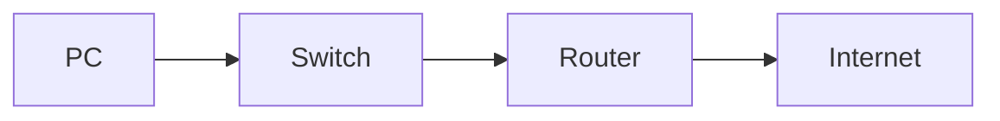

### RA2. Integra ordenadores y periféricos en redes cableadas e inalámbricas, evaluando su funcionamiento y prestaciones.

| Criterio de evaluación | Tipo | Ponderación |
|:-----------|:-----:|:-----:|
| h) Se han utilizado aplicaciones para representar el mapa físico y lógico de una red. | Práctico |  15 % | 

### 1. Introducción
Las redes actuales pueden estar formadas por decenas o incluso cientos de dispositivos interconectados. Para facilitar su instalación, administración y mantenimiento es necesario disponer de una representación gráfica que muestre cómo están organizados los equipos y cómo se comunican entre sí. Los **mapas de red** permiten documentar la infraestructura, localizar incidencias y comprender el funcionamiento global de la red.

En este criterio aprenderemos a diferenciar los mapas físicos y lógicos, conoceremos las aplicaciones más utilizadas para su representación y estudiaremos las buenas prácticas para documentar adecuadamente una red.

### 2. ¿Qué es un mapa de red?
Un **mapa de red** es una representación gráfica de los dispositivos, conexiones y relaciones existentes dentro de una infraestructura de comunicaciones. Su objetivo es facilitar:

- La comprensión de la red.
- La planificación de ampliaciones.
- La resolución de incidencias.
- La documentación técnica.
- La administración de la infraestructura.

Existen dos tipos principales de mapas: **Mapa físico** y **mapa lógico.**

### 3. Mapa físico de una red
El **mapa físico** representa la disposición real de los dispositivos y las conexiones existentes. Es especialmente útil para tareas de instalación y mantenimiento. Muestra información como:

- Ubicación de equipos.
- Cableado.
- Armarios de comunicaciones.
- Switches.
- Routers.
- Puntos de acceso.
- Servidores.


### 4. Mapa lógico de una red
El **mapa lógico** representa cómo se comunican los dispositivos independientemente de su ubicación física. Es fundamental para comprender el funcionamiento interno de la red. Muestra información como:

- Direcciones IP.
- Redes y subredes.
- VLAN.
- Rutas.
- Servicios.
- Relaciones entre dispositivos.


### 5. Diferencias entre mapa físico y lógico

| Característica | Mapa físico | Mapa lógico |
|----------------|-------------|-------------|
| Representa ubicación real | Sí | No |
| Muestra cableado | Sí | No |
| Muestra direcciones IP | No | Sí |
| Representa subredes | No | Sí |
| Facilita instalaciones | Sí | Parcialmente |
| Facilita administración | Parcialmente | Sí |

Ambos tipos de mapas son complementarios.

### 6. Importancia de la documentación
Una red correctamente documentada permite:

- Localizar equipos rápidamente.
- Reducir tiempos de reparación.
- Facilitar ampliaciones.
- Compartir información entre administradores.
- Mejorar la seguridad.

La documentación es una tarea esencial en cualquier infraestructura profesional.

### 7. Información que debe incluir un mapa de red
Un buen mapa de red debería incluir:

- Nombre de los dispositivos.
- Tipo de equipo.
- Direcciones IP.
- Conexiones.
- Velocidad de los enlaces.
- Número de puerto.
- VLAN (si existen).
- Ubicación física.

### 8. Aplicaciones para representar redes
Existen numerosas herramientas para crear mapas de red. Algunas permiten diseñarlos manualmente y otras pueden generarlos automáticamente.

#### 8.1. Herramientas de diseño manual
##### Draw.io (diagrams.net)
Es una de las herramientas más utilizadas.

>💡 **Características:** Gratuita, funciona en navegador, gran cantidad de iconos de red y fácil exportación.

>👉 **Ejemplo de uso:** Diagramas de aulas, redes pequeñas y documentación técnica.

##### Microsoft Visio
Herramienta profesional para crear diagramas, muy utilizada en empresas.

>💡 **Características:** Integración con Microsoft Office, plantillas específicas para redes y diagramas avanzados.

##### LibreOffice Draw
Alternativa libre para crear esquemas y diagramas.

#### 8.2. Herramientas de diagramación mediante código
Actualmente existen herramientas que permiten generar diagramas a partir de texto.

##### D2
Permite crear diagramas escribiendo código sencillo. Es especialmente útil en proyectos de documentación técnica.

👉 **Ejemplo:**

```d2
PC1 -> Switch
PC2 -> Switch
Switch -> Router
Router -> Internet
```

>✅ **Ventajas:** Fácil mantenimiento, integración con GitHub y control de versiones.

##### Mermaid
También permite generar diagramas mediante texto.

👉 **Ejemplo:**



#### 8.3. Herramientas de detección automática
Algunas aplicaciones pueden detectar automáticamente los dispositivos de una red.

##### Nmap
Permite descubrir equipos activos.

👉 **Ejemplo:**

```bash
nmap 192.168.1.0/24
```

Obtiene información sobre:

- Equipos activos.
- Servicios.
- Puertos abiertos.

##### Angry IP Scanner
Aplicación gráfica sencilla para detectar dispositivos.

##### Fing
Herramienta para análisis de redes. Puede utilizarse en ordenadores y dispositivos móviles.

### 9. Buenas prácticas
Para representar correctamente una red es recomendable:

- Utilizar símbolos estandarizados.
- Nombrar todos los dispositivos.
- Documentar direcciones IP.
- Actualizar los diagramas.
- Diferenciar claramente la parte física y lógica.
- Mantener versiones actualizadas.

### 10. Caso práctico

Un instituto dispone de varias aulas de informática, una sala de servidores, puntos de acceso Wi-Fi y diferentes switches distribuidos por el edificio. El departamento de informática desea crear una documentación completa de la red para facilitar futuras ampliaciones y mejorar la resolución de incidencias. Para ello, será necesario representar tanto la ubicación física de los equipos como las relaciones lógicas entre las distintas subredes, direcciones IP y servicios disponibles.

> **Analiza la infraestructura descrita e indica qué información incluirías en el mapa físico y en el mapa lógico de la red. Explica también qué herramientas utilizarías para elaborar esta documentación y qué ventajas aportaría mantenerla actualizada.**